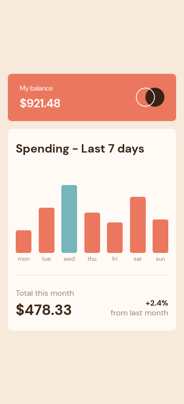

# Frontend Mentor - Expenses chart component solution

This is a solution to the [Expenses chart component challenge on Frontend Mentor](https://www.frontendmentor.io/challenges/expenses-chart-component-e7yJBUdjwt). Frontend Mentor challenges help you improve your coding skills by building realistic projects. 

## Table of contents

- [Overview](#overview)
  - [The challenge](#the-challenge)
  - [Screenshot](#screenshot)
  - [Links](#links)
- [My process](#my-process)
  - [Built with](#built-with)
  - [Useful resources](#useful-resources)
- [Author](#author)

**Note: Delete this note and update the table of contents based on what sections you keep.**

## Overview

### The challenge

Users should be able to:

- View the bar chart and hover over the individual bars to see the correct amounts for each day
- See the current day’s bar highlighted in a different colour to the other bars
- View the optimal layout for the content depending on their device’s screen size
- See hover states for all interactive elements on the page
- Use the JSON data file provided to dynamically size the bars on the chart

### Screenshot

### Links

- Solution URL: (https://github.com/LikemD/fe-mentor/tree/main/expenses-chart-component)
- Live Site URL: (https://expenses-component-tau.vercel.app/)

## My process

### Built with

- Semantic HTML5 markup
- TailwindCSS
- Mobile-first workflow
- [React](https://reactjs.org/) - JS library
- [Zustand](https://www.npmjs.com/package/zustand) - State management solution for react

### Useful resources

- [Zustand](https://www.npmjs.com/package/zustand) - This helped me manage state for react without the large boilerplate that redux. It is reactive and triggers the DOM to rerender when state chages. I really liked this package and will be using it for react projects.

## Author

- Frontend Mentor - [@LikemD](https://www.frontendmentor.io/profile/LikemD)
- Twitter - [@LikemDunyo](https://www.twitter.com/LikemDunyo)