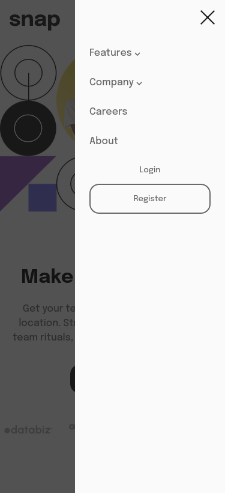

# Frontend Mentor - Intro section with dropdown navigation solution

This is a solution to the [Intro section with dropdown navigation challenge on Frontend Mentor](https://www.frontendmentor.io/challenges/intro-section-with-dropdown-navigation-ryaPetHE5). Frontend Mentor challenges help you improve your coding skills by building realistic projects. 

## Table of contents

- [Overview](#overview)
  - [The challenge](#the-challenge)
  - [Screenshot](#screenshot)
  - [Links](#links)
- [My process](#my-process)
  - [Built with](#built-with)
  - [What I learned](#what-i-learned)
  - [Continued development](#continued-development)
- [Author](#author)

## Overview

### The challenge

Users should be able to:

- View the relevant dropdown menus on desktop and mobile when interacting with the navigation links
- View the optimal layout for the content depending on their device's screen size
- See hover states for all interactive elements on the page

### Screenshot

### Links

- Solution URL: [https://github.com/LikemD/fe-mentor/tree/main/intro-section-with-dropdown-navigation-main](https://your-solution-url.com)
- Live Site URL: [https://fe-mentor-eight.vercel.app/intro-section-with-dropdown-navigation-main/index.html](https://your-live-site-url.com)

## My process

### Built with

- Semantic HTML5 markup
- CSS custom properties
- Flexbox
- Mobile-first workflow

### What I learned

I learned how to manipulate the DOM using vanilla javascript

### Continued development

Going forward i will work on my implementation of the navigation bar

## Author

- Frontend Mentor - [@LikemD](https://www.frontendmentor.io/profile/LikemD)
- Twitter - [@LikemDunyo](https://www.twitter.com/LikemDunyo)
