# Frontend Mentor - Space tourism website solution

This is a solution to the [Space tourism website challenge on Frontend Mentor](https://www.frontendmentor.io/challenges/space-tourism-multipage-website-gRWj1URZ3). Frontend Mentor challenges help you improve your coding skills by building realistic projects. 

## Table of contents

- [Overview](#overview)
  - [The challenge](#the-challenge)
  - [Screenshot](#screenshot)
  - [Links](#links)
- [My process](#my-process)
  - [Built with](#built-with)
  - [What I learned](#what-i-learned)
  - [Useful resources](#useful-resources)
- [Author](#author)

## Overview

### The challenge

Users should be able to:

- View the optimal layout for each of the website's pages depending on their device's screen size
- See hover states for all interactive elements on the page
- View each page and be able to toggle between the tabs to see new information

### Screenshot

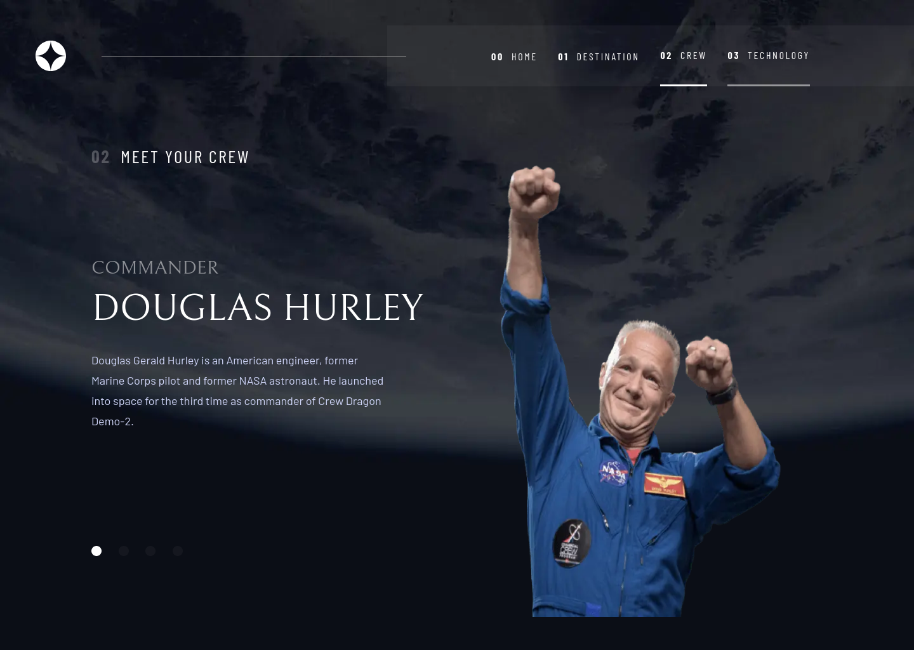
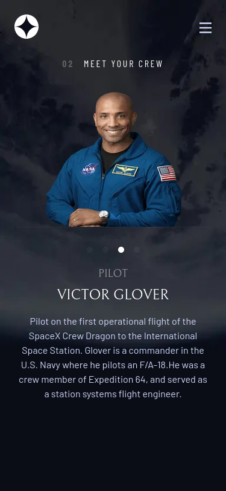
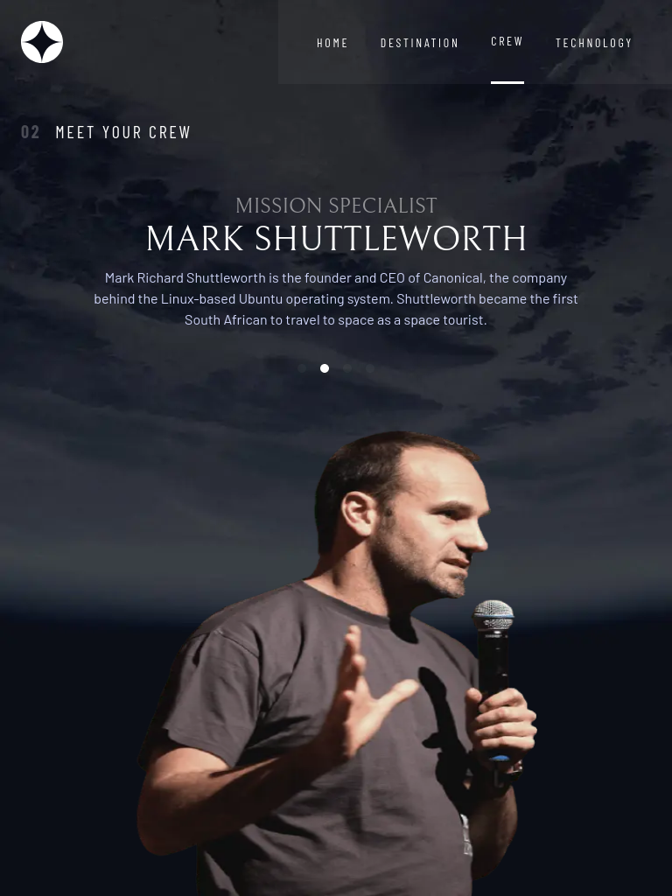
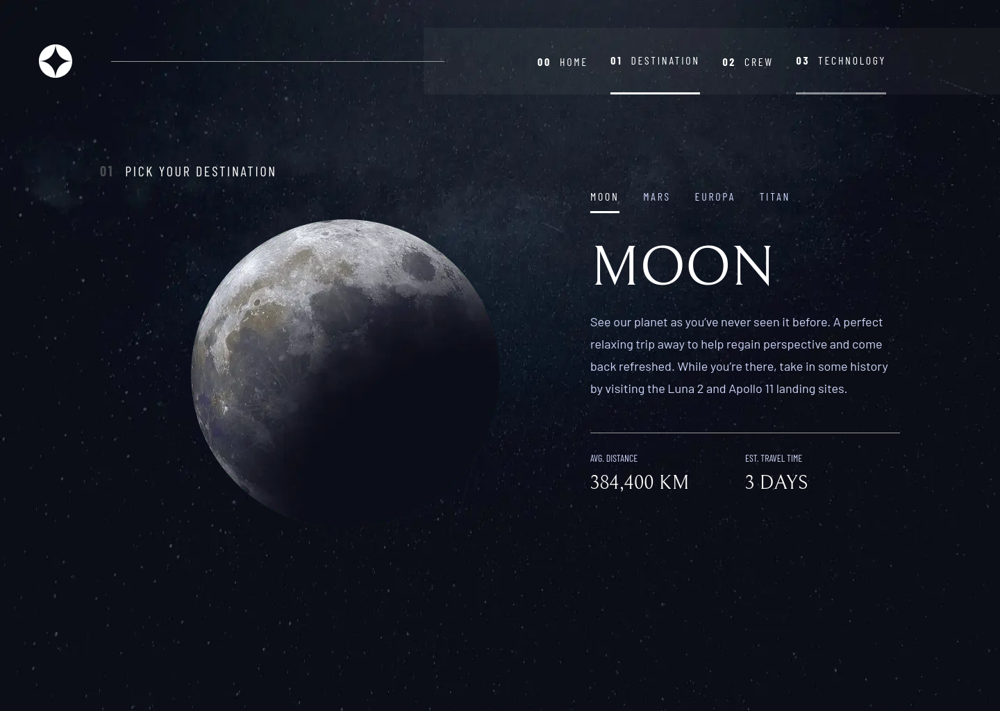
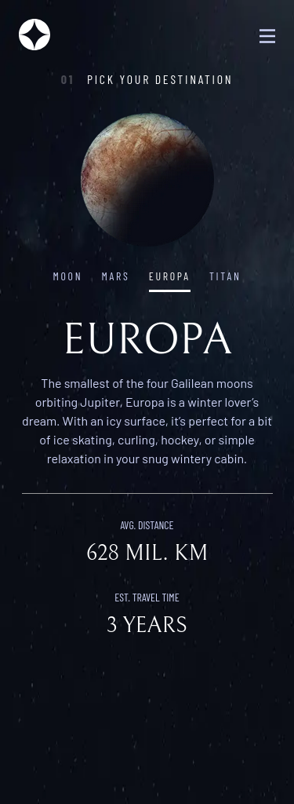
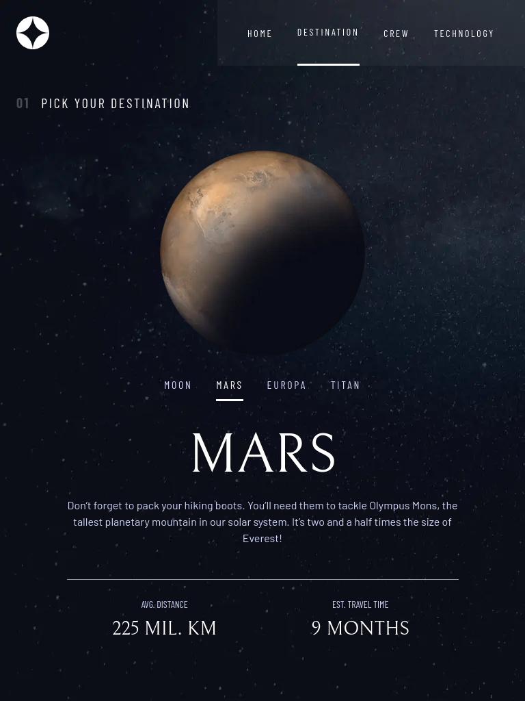
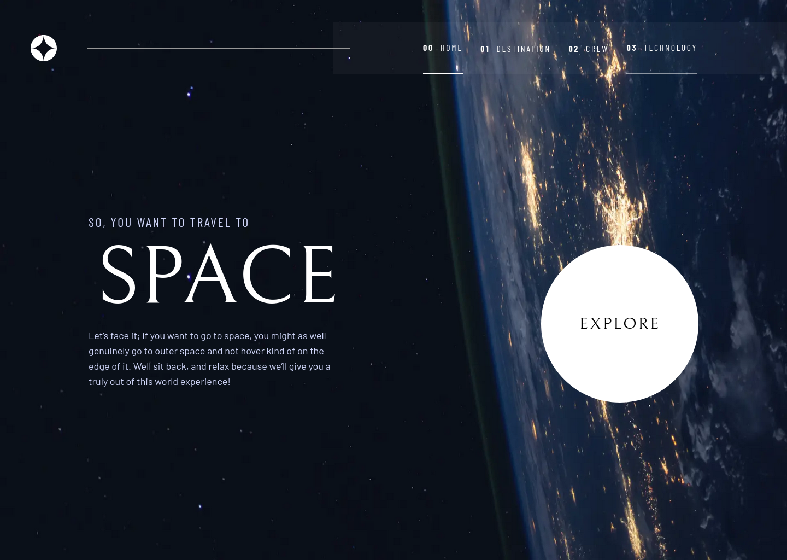
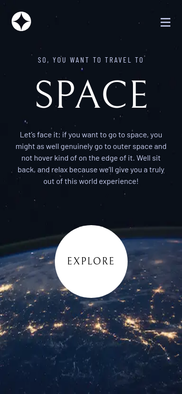
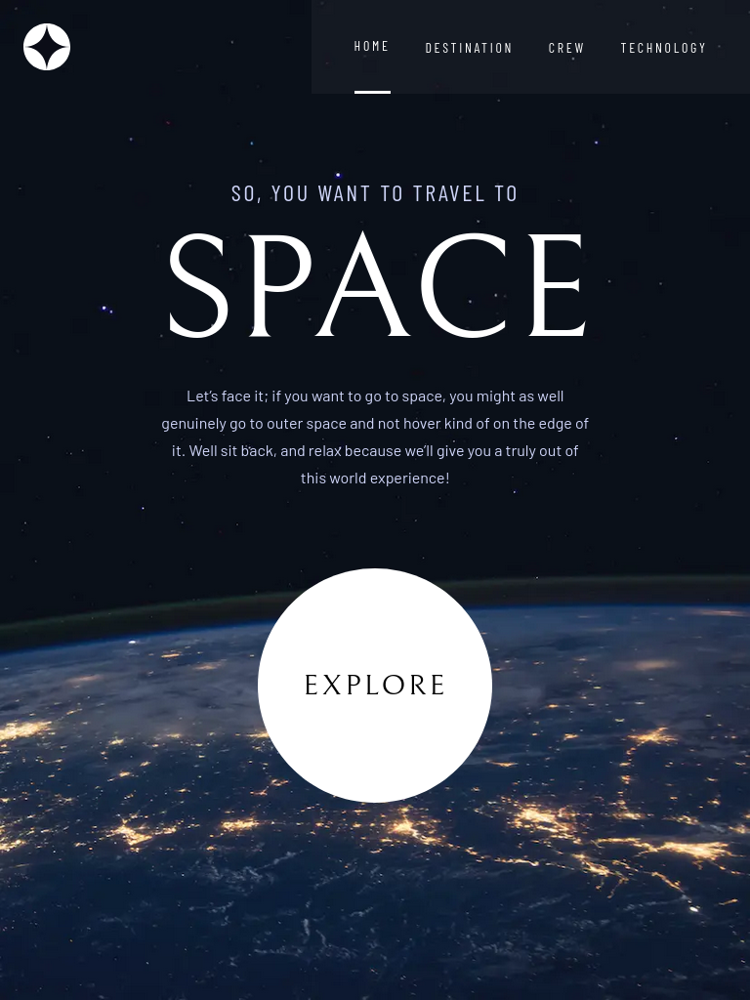
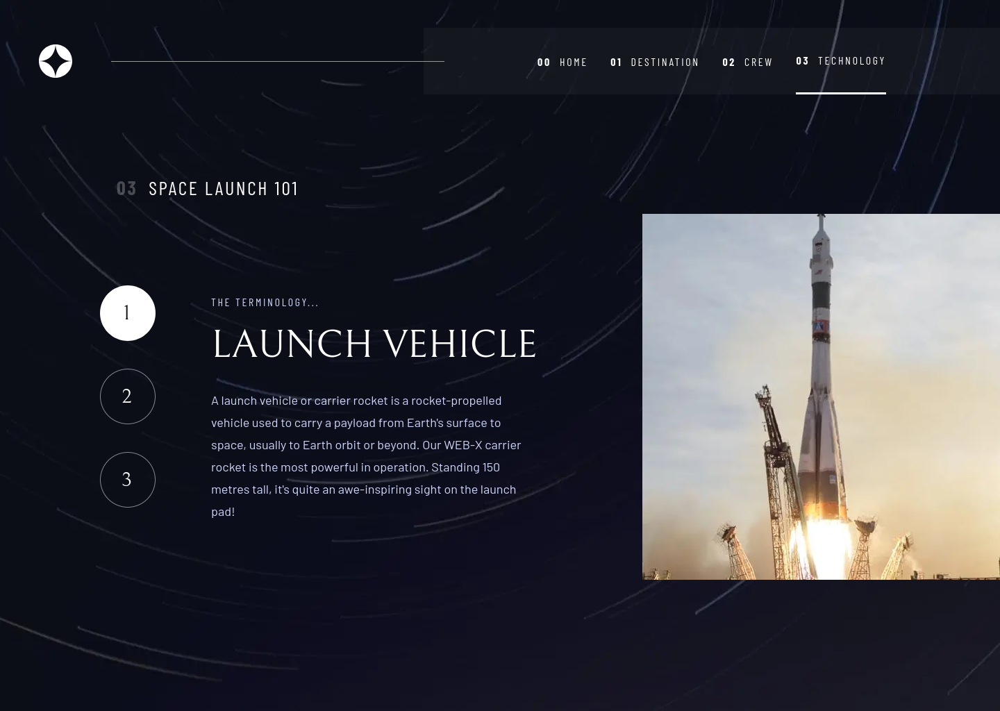
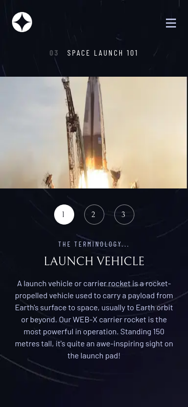
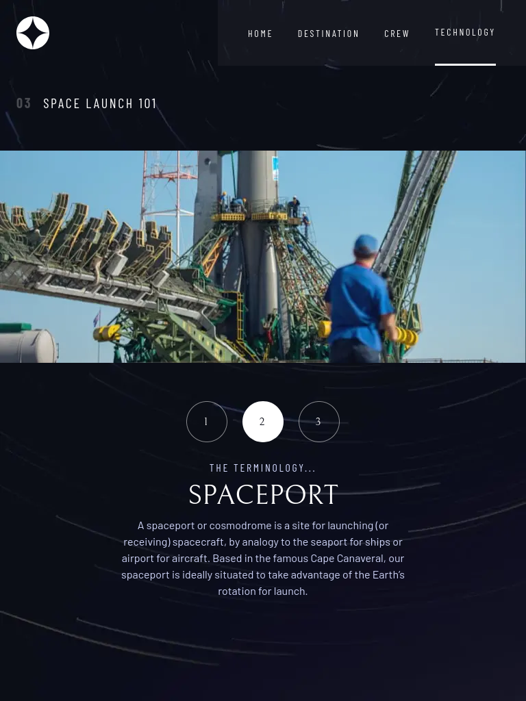

### Links

- Solution URL: [Space Tourism Github Repo](https://github.com/LikemD/fe-mentor/tree/main/space-tourism-website/)
- Live Site URL: [Space Tourism Website](https://space-tourism-likemd.vercel.app/)

## My process

### Built with

- Semantic HTML5 markup
- Flexbox
- Mobile-first workflow
- [React](https://reactjs.org/) - JS library
- [Next.js](https://nextjs.org/) - React framework
- [Tailwindcss](https://tailwindcss.com/) - For styles

### What I learned

- I learned how to make responsive background images in Next.js

### Useful resources

- [Responsive Background Image With Next.js](https://www.youtube.com/watch?v=IVfqp_EIuwc) - This video helped me design responsive background images for this project. I'd use this technique going forward and i'd recommend it to anyone still learning the concept.

## Author

- Frontend Mentor - [@LikemD](https://www.frontendmentor.io/profile/LikemD)
- Twitter - [@LikemDunyo](https://www.twitter.com/LikemDunyo)

